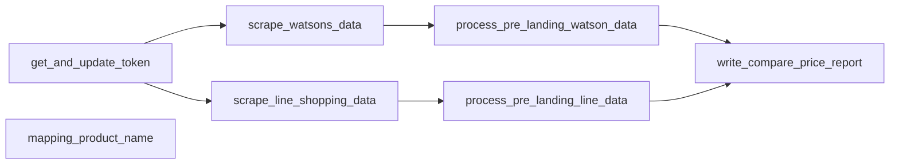

# E-commerce Product Comparison and Scraping Project

This project focuses on scraping product information from selected e-commerce websites, transforming the data, and generating comparison reports. It leverages various modern data tools and practices to ensure efficient and scalable data processing.

## Scope
- **Select 2 E-commerce Websites:**
	- Watson
	- Line Shopping
- **Choose Stores:**
	- Vistra
	- BLACKMORES
	- Dettol
	- Swisse
	- Eucerin
- **Tools Utilized:**
	- Polars and PyArrow for data transformation.
	- Delta Lake format for structured data management.
	- Minio for data storage.
	- Google Drive for report uploads.
	- text-embedding-3-small and GPT-4o-mini for identifying product names with similar meanings.
	- Selenium and Browser Proxy for scraping product information from websites.
	- Airflow for workflow management.
	- Docker for containerization.
- **Requirements:**
	- `google_service_account.json` and `Google Drive API` for Google Drive management.
	- `airflow_variables.json` for temporary secret storage in Airflow.
	- `ecommerce_product_comparisons_final.csv` to serve as the base product name for items from Line and Watson.

---

## Project Flow


---

## Quick Start

## 0. Prerequisite
- Config File [Google Drive](https://drive.google.com/drive/folders/1ciyLMz9SO_A4WQVr7GG5Y1DptbaAjz3G?usp=sharing)
- Report Folder [Google Drive](https://drive.google.com/drive/folders/1EXRnLYXXxjc46nBcJ8DYKjEhv5zd-xfE?usp=sharing)

### 1. Prepare Environment

Please download the necessary config files from Google Drive and place them in the root directory of your project. The files you need are:
- `google_service_account.json`
- `airflow_variables.json`
- `ecommerce_product_comparisons_final.csv`

First, you'll need to **build the Docker image** for your project. From the root directory of your project, use the following command:

```bash
docker build -t e_commerce_scrap -f docker/Dockerfile .
```

Once the image is built, you can then **bring up your Docker Compose services** in detached mode (meaning they'll run in the background):

```bash
docker-compose up -d
```

The services and the ports you can access:
- **airflow-apiserver** (Web): This service is accessible on port `8082`.
  - user: `airflow`
  - pass: `airflow`
- **flower**: This service is accessible on port `5555`.
- **minio**: This service is accessible on ports `9002` (for the MinIO API) and `9003` (for the MinIO console).
  - user: `minioadmin`
  - pass: `minioadmin`

### 2. Prepare Configuration

Once all services are ready, please create a **bucket** named `data-pipeline-demo` in Minio. Afterward, upload the `ecommerce_product_comparisons_final.csv` file to the `data-pipeline-demo/cache` path within that **bucket**.

For Airflow, navigate to Variables, then import `airflow_variables.json` and adjust the values for actual use.

### 3. Run Workflow

- Go to the DAGs page, select `web_scraping_dag`, and then click the Trigger button to run it.

---

## Challenge

- **Product names** differ across retailers, making automated processing difficult and requiring a combination of **AI for matching** and human filtering.
- Utilizing **Browsermob Proxy** to capture Watson's tokens (for API calls to retrieve product listings) requires **Java 8**, which is not available in Debian. This necessitates building from an Ubuntu image. For production, isolating the token interception process into a separate container is advisable.
- **Matching product names** from various stores is a time-consuming process, though optimization could lead to faster operations.